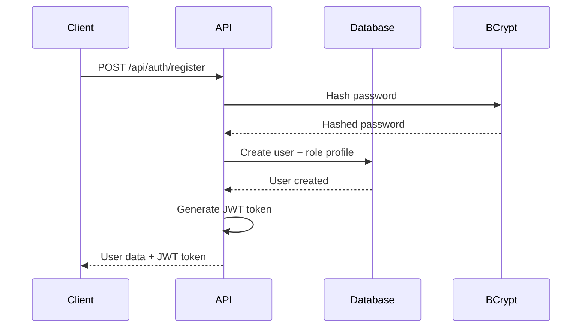

# Course Management Platform Backend

A comprehensive backend system for academic institutions to manage faculty operations, monitor student progress, and enhance academic coordination. Built with Node.js, Express, MySQL, Sequelize ORM, and Redis.


## 📋 Table of Contents

- [Features](#-features)
- [System Architecture](#-system-architecture)
- [Installation](#-installation)
- [Database Schema](#-database-schema)
- [Authentication Flow](#-authentication-flow)
- [API Documentation](#-api-documentation)
- [Testing](#-testing)
- [Student Reflection Page](#-student-reflection-page)
- [Performance Optimization](#-performance-optimization)
- [Security Best Practices](#-security-best-practices)
- [Monitoring and Analytics](#-monitoring-and-analytics)
- [Deployment](#-deployment)
- [Contributing](#-contributing)

## ✨ Features

### 🔐 Authentication & Authorization
- **JWT-based Authentication**: Secure token-based authentication system
- **Role-based Access Control**: Three distinct roles (Manager, Facilitator, Student)
- **Password Security**: bcrypt hashing with 12 salt rounds
- **Session Management**: Secure token expiration and refresh

### 📚 Course Allocation System
- **CRUD Operations**: Complete course management for managers
- **Advanced Filtering**: Filter by trimester, cohort, intake, facilitator, and mode
- **Relationship Management**: Complex model relationships with foreign key constraints
- **Access Control**: Role-based permissions for data access and modification

### 📊 Facilitator Activity Tracker (FAT)
- **Weekly Logging**: Comprehensive activity tracking per course assignment
- **Status Management**: Track progress with Done/Pending/Not Started states
- **Attendance Tracking**: Boolean array for student attendance records
- **Grading Workflow**: Formative and summative assessment tracking

### 🔔 Notification System
- **Redis Queue Management**: Background job processing with Bull
- **Automated Reminders**: Deadline notifications for facilitators
- **Manager Alerts**: Real-time notifications for compliance monitoring
- **Background Workers**: Scalable notification processing

### 🌐 Student Reflection Page
- **Multilingual Support**: English and French language options
- **Dynamic Translation**: Real-time language switching
- **Auto-save Functionality**: Local storage draft preservation
- **Responsive Design**: Mobile-first approach with accessibility features

## 🏗️ System Architecture

```
┌─────────────────┐    ┌─────────────────┐    ┌─────────────────┐
│   Client App    │────│  Express API    │────│   MySQL DB      │
│   (Frontend)    │    │   (Backend)     │    │  (Data Layer)   │
└─────────────────┘    └─────────────────┘    └─────────────────┘
                                │
                                │
                       ┌─────────────────┐
                       │   Redis Queue   │
                       │ (Notifications) │
                       └─────────────────┘
```

### Core Components

- **Express.js Server**: RESTful API with middleware stack
- **Sequelize ORM**: Database abstraction and relationship management
- **Redis**: Queue management and caching
- **JWT Authentication**: Stateless authentication system
- **Bull Queues**: Background job processing
- **Swagger**: API documentation and testing interface

## 🚀 Installation

### Prerequisites

- Node.js (v16+ recommended)
- MySQL (v8.0+)
- Redis (v6.0+)
- npm or yarn package manager

### Quick Start

1. **Clone the repository**
   ```bash
   git clone https://github.com/yourusername/course-management-platform.git
   cd course-management-platform
   ```

2. **Install dependencies**
   ```bash
   npm install
   ```

3. **Environment setup**
   ```bash
   cp .env.example .env
   # Edit .env with your configuration
   ```

4. **Database setup**
   ```bash
   # Create databases
   mysql -u root -p < scripts/setup-database.sql
   
   # Run migrations
   npm run migrate
   
   # Seed sample data
   npm run seed
   ```

5. **Start Redis server**
   ```bash
   redis-server
   ```

6. **Launch the application**
   ```bash
   # Development mode
   npm run dev
   
   # Production mode
   npm start
   ```

### Environment Variables

Create a `.env` file in the root directory:

```env
NODE_ENV=development
PORT=3000
JWT_SECRET=your-super-secret-jwt-key-change-in-production
JWT_EXPIRE=24h

# Database
DB_HOST=localhost
DB_PORT=3306
DB_NAME=course_management
DB_USER=root
DB_PASS=password

# Redis
REDIS_HOST=localhost
REDIS_PORT=6379
REDIS_PASSWORD=

# Email (optional for notifications)
EMAIL_HOST=smtp.gmail.com
EMAIL_PORT=587
EMAIL_USER=your-email@gmail.com
EMAIL_PASS=your-app-password
```

## 🗄️ Database Schema

### Entity Relationship Diagram

```
Users (1:1) ─────── Managers
  │                    │
  │                    │ (1:N)
  │               CourseOfferings ─────── (N:1) Modules
  │                    │                        │
  │ (1:1)              │ (N:1)                  │
Facilitators ──────────┘                        │
  │                    │                        │
  │ (1:N)              │ (1:N)                  │
ActivityTrackers ──────┘                        │
                       │                        │
                    Classes ────────────────────┘
                       │
                    Cohorts
                       │
                     Modes
```

### Core Tables

#### Users Table
```sql
CREATE TABLE users (
  id INT PRIMARY KEY AUTO_INCREMENT,
  email VARCHAR(255) UNIQUE NOT NULL,
  password VARCHAR(255) NOT NULL,
  first_name VARCHAR(50) NOT NULL,
  last_name VARCHAR(50) NOT NULL,
  role ENUM('manager', 'facilitator', 'student') NOT NULL,
  is_active BOOLEAN DEFAULT true,
  created_at TIMESTAMP DEFAULT CURRENT_TIMESTAMP,
  updated_at TIMESTAMP DEFAULT CURRENT_TIMESTAMP ON UPDATE CURRENT_TIMESTAMP
);
```

#### Course Offerings Table
```sql
CREATE TABLE course_offerings (
  id INT PRIMARY KEY AUTO_INCREMENT,
  module_id INT NOT NULL,
  class_id INT NOT NULL,
  cohort_id INT NOT NULL,
  mode_id INT NOT NULL,
  facilitator_id INT,
  start_date DATE NOT NULL,
  end_date DATE NOT NULL,
  max_students INT,
  is_active BOOLEAN DEFAULT true,
  UNIQUE KEY unique_course_offering (module_id, class_id, cohort_id, mode_id),
  created_at TIMESTAMP DEFAULT CURRENT_TIMESTAMP,
  updated_at TIMESTAMP DEFAULT CURRENT_TIMESTAMP ON UPDATE CURRENT_TIMESTAMP
);
```

#### Activity Trackers Table
```sql
CREATE TABLE activity_trackers (
  id INT PRIMARY KEY AUTO_INCREMENT,
  allocation_id INT NOT NULL,
  week_number INT NOT NULL,
  attendance JSON,
  formative_one_grading ENUM('Done', 'Pending', 'Not Started') DEFAULT 'Not Started',
  formative_two_grading ENUM('Done', 'Pending', 'Not Started') DEFAULT 'Not Started',
  summative_grading ENUM('Done', 'Pending', 'Not Started') DEFAULT 'Not Started',
  course_moderation ENUM('Done', 'Pending', 'Not Started') DEFAULT 'Not Started',
  intranet_sync ENUM('Done', 'Pending', 'Not Started') DEFAULT 'Not Started',
  grade_book_status ENUM('Done', 'Pending', 'Not Started') DEFAULT 'Not Started',
  notes TEXT,
  submitted_at TIMESTAMP,
  UNIQUE KEY unique_activity_tracker_week (allocation_id, week_number),
  created_at TIMESTAMP DEFAULT CURRENT_TIMESTAMP,
  updated_at TIMESTAMP DEFAULT CURRENT_TIMESTAMP ON UPDATE CURRENT_TIMESTAMP
);
```

### Relationships

- `Users` has one-to-one relationships with `Managers`, `Facilitators`, and `Students`
- `CourseOfferings` belongs to `Module`, `Class`, `Cohort`, `Mode`, and `Facilitator`
- `ActivityTrackers` belongs to `CourseOfferings`
- All foreign key relationships include CASCADE updates and appropriate DELETE constraints

## 🔐 Authentication Flow

### User Registration Process



### Authentication Middleware

```javascript
// Example usage in routes
router.get('/protected', authenticate, (req, res) => {
  // req.user contains authenticated user data
  res.json({ user: req.user });
});

router.post('/admin-only', authenticate, authorize('manager'), (req, res) => {
  // Only managers can access this endpoint
  res.json({ message: 'Admin access granted' });
});
```

### JWT Token Structure

```json
{
  "header": {
    "alg": "HS256",
    "typ": "JWT"
  },
  "payload": {
    "id": 1,
    "email": "user@example.com",
    "role": "facilitator",
    "iat": 1640995200,
    "exp": 1641081600
  }
}
```

## 📖 API Documentation

### Base URL

```
http://localhost:3000/api
```

### Authentication Endpoints

#### Register User

```http
POST /api/auth/register
Content-Type: application/json

{
  "email": "user@example.com",
  "password": "password123",
  "first_name": "John",
  "last_name": "Doe",
  "role": "facilitator",
  "specialization": "Web Development",
  "employee_id": "FAC001"
}
```

**Response:**
```json
{
  "message": "User registered successfully",
  "user": {
    "id": 1,
    "email": "user@example.com",
    "first_name": "John",
    "last_name": "Doe",
    "role": "facilitator",
    "is_active": true
  },
  "token": "eyJhbGciOiJIUzI1NiIsInR5cCI6IkpXVCJ9..."
}
```

#### Login
```http
POST /api/auth/login
Content-Type: application/json

{
  "email": "user@example.com",
  "password": "password123"
}
```

### Course Management Endpoints

#### Get Course Offerings

```http
GET /api/course-offerings?trimester=1&cohort_id=1&facilitator_id=2
Authorization: Bearer <jwt-token>
```

**Response:**
```json
[
  {
    "id": 1,
    "start_date": "2024-01-15",
    "end_date": "2024-04-15",
    "max_students": 30,
    "is_active": true,
    "module": {
      "id": 1,
      "code": "CS101",
      "name": "Introduction to Programming",
      "credits": 3
    },
    "facilitator": {
      "id": 1,
      "user": {
        "first_name": "Jane",
        "last_name": "Smith",
        "email": "jane@example.com"
      }
    }
  }
]
```

#### Create Course Offering (Manager Only)
```http
POST /api/course-offerings
Authorization: Bearer <manager-jwt-token>
Content-Type: application/json

{
  "module_id": 1,
  "class_id": 1,
  "cohort_id": 1,
  "mode_id": 1,
  "facilitator_id": 2,
  "start_date": "2024-01-15",
  "end_date": "2024-04-15",
  "max_students": 30
}
```

### Activity Tracker Endpoints

#### Submit Activity Log (Facilitator Only)

```http
POST /api/activity-tracker
Authorization: Bearer <facilitator-jwt-token>
Content-Type: application/json

{
  "allocation_id": 1,
  "week_number": 5,
  "attendance": [true, true, false, true, true],
  "formative_one_grading": "Done",
  "formative_two_grading": "Pending",
  "summative_grading": "Not Started",
  "course_moderation": "Done",
  "intranet_sync": "Done",
  "grade_book_status": "Pending",
  "notes": "Good participation this week"
}
```

#### Get Activity Logs with Filters

```http
GET /api/activity-tracker?allocation_id=1&week_number=5&status=Pending
Authorization: Bearer <jwt-token>
```

### Error Handling

All API endpoints return consistent error responses:

```json
{
  "error": "Validation error",
  "details": [
    "Email is required",
    "Password must be at least 6 characters"
  ]
}
```

### Status Codes

- `200` - Success
- `201` - Created
- `400` - Bad Request (Validation Error)
- `401` - Unauthorized
- `403` - Forbidden
- `404` - Not Found
- `409` - Conflict (Duplicate Entry)
- `500` - Internal Server Error

## 🧪 Testing

### Running Tests

```bash
# Run all tests
npm test

# Run tests with coverage
npm test -- --coverage

# Run tests in watch mode
npm run test:watch

# Run specific test file
npm test -- src/tests/models/User.test.js
```

### Test Structure

```
src/tests/
├── models/           # Model unit tests
│   ├── User.test.js
│   ├── Module.test.js
│   └── CourseOffering.test.js
├── middleware/       # Middleware tests
│   └── auth.test.js
├── services/         # Service tests
│   └── notificationService.test.js
├── utils/           # Test utilities
│   └── testHelpers.js
└── setup.js         # Test configuration
```

### Sample Test Output

```
 PASS  src/tests/models/User.test.js
  User Model
    User Creation
      ✓ should create a valid user (45ms)
      ✓ should hash password before saving (52ms)
      ✓ should fail validation with invalid email (23ms)
      ✓ should not allow duplicate emails (38ms)
    User Methods
      ✓ comparePassword should work correctly (67ms)
      ✓ toJSON should exclude password (12ms)

Test Suites: 5 passed, 5 total
Tests:       23 passed, 23 total
Snapshots:   0 total
Time:        3.847s
Coverage:    92.31% Lines, 88.24% Branches
```

### Integration Testing

Use Supertest for API endpoint testing:

```javascript
const request = require('supertest');
const app = require('../../server');

describe('Auth Endpoints', () => {
  test('POST /api/auth/login should authenticate user', async () => {
    const response = await request(app)
      .post('/api/auth/login')
      .send({
        email: 'test@example.com',
        password: 'password123'
      });

    expect(response.status).toBe(200);
    expect(response.body.token).toBeDefined();
  });
});
```

## 🌐 Student Reflection Page

### Features

- **Multilingual Support**: Dynamic switching between English and French
- **Auto-save Functionality**: Local storage preservation of draft responses
- **Responsive Design**: Mobile-first approach with accessibility features
- **Form Validation**: Client-side validation with user-friendly error messages
- **Keyboard Navigation**: Full keyboard accessibility support

### Deployment

The reflection page is designed to be hosted on GitHub Pages:

1. **Repository Setup**
   ```bash
   # Create a separate repository for the reflection page
   git clone https://github.com/yourusername/course-reflection-page.git
   cd course-reflection-page
   
   # Copy the student-reflection folder contents
   cp -r ../course-management-platform/student-reflection/* .
   ```

2. **GitHub Pages Configuration**
   - Go to repository Settings → Pages
   - Select source: Deploy from a branch
   - Choose branch: main
   - Folder: / (root)

3. **Access URL**
   ```
   https://yourusername.github.io/course-reflection-page/
   ```

### Technical Implementation

#### Language Switching
```javascript
switchLanguage(lang) {
  this.currentLang = lang;
  this.storeLanguage(lang);
  this.loadLanguage(lang);
  
  // Update UI elements
  document.querySelectorAll('[data-translate]').forEach(element => {
    const key = element.dataset.translate;
    element.textContent = this.translate(key);
  });
}
```

#### Auto-save Mechanism

```javascript
setupAutoSave() {
  // Auto-save every 30 seconds
  setInterval(() => {
    if (this.hasFormData()) {
      this.saveDraft(true);
      this.showAutoSaveIndicator();
    }
  }, 30000);
}
```

#### Local Storage Structure
```json
{
  "reflection_draft": {
    "question1": "I enjoyed the practical coding exercises...",
    "question2": "The most challenging part was debugging...",
    "question3": "More interactive examples would help...",
    "timestamp": "2024-01-15T10:30:00.000Z",
    "language": "en"
  },
  "reflection_language": "en"
}
```

## 📈 Performance Optimization

### Database Optimization

1. **Indexing Strategy**
   ```sql
   -- Add indexes for frequently queried columns
   CREATE INDEX idx_course_offerings_facilitator ON course_offerings(facilitator_id);
   CREATE INDEX idx_activity_trackers_allocation_week ON activity_trackers(allocation_id, week_number);
   CREATE INDEX idx_users_role_active ON users(role, is_active);
   ```

2. **Query Optimization**
   ```javascript
   // Use specific attributes instead of SELECT *
   const users = await User.findAll({
     attributes: ['id', 'first_name', 'last_name', 'email'],
     where: { is_active: true }
   });

   // Use includes wisely to avoid N+1 queries
   const courseOfferings = await CourseOffering.findAll({
     include: [
       { model: Module, as: 'module', attributes: ['id', 'name', 'code'] },
       { model: Facilitator, as: 'facilitator', required: false }
     ]
   });
   ```

### Caching Strategy

```javascript
const redis = require('redis');
const client = redis.createClient();

// Cache frequently accessed data
const getCachedCourseOfferings = async (filters) => {
  const cacheKey = `course_offerings:${JSON.stringify(filters)}`;
  const cached = await client.get(cacheKey);
  
  if (cached) {
    return JSON.parse(cached);
  }
  
  const data = await CourseOffering.findAll(filters);
  await client.setex(cacheKey, 300, JSON.stringify(data)); // Cache for 5 minutes
  
  return data;
};
```

### Rate Limiting

```javascript
const rateLimit = require('express-rate-limit');

// API rate limiting
const apiLimiter = rateLimit({
  windowMs: 15 * 60 * 1000, // 15 minutes
  max: 100, // Limit each IP to 100 requests per windowMs
  message: 'Too many requests from this IP, please try again later.'
});

// Auth endpoints stricter limiting
const authLimiter = rateLimit({
  windowMs: 15 * 60 * 1000,
  max: 5,
  message: 'Too many authentication attempts, please try again later.'
});

app.use('/api/', apiLimiter);
app.use('/api/auth/', authLimiter);
```

## 🔒 Security Best Practices

### Input Validation

```javascript
const Joi = require('joi');

// Comprehensive validation schemas
const schemas = {
  courseOffering: Joi.object({
    module_id: Joi.number().integer().positive().required(),
    class_id: Joi.number().integer().positive().required(),
    cohort_id: Joi.number().integer().positive().required(),
    mode_id: Joi.number().integer().positive().required(),
    facilitator_id: Joi.number().integer().positive().optional(),
    start_date: Joi.date().iso().required(),
    end_date: Joi.date().iso().greater(Joi.ref('start_date')).required(),
    max_students: Joi.number().integer().min(1).max(100).optional()
  })
};
```

### SQL Injection Prevention

```javascript
// Always use parameterized queries
const users = await User.findAll({
  where: {
    role: req.query.role, // Sequelize automatically parameterizes
    is_active: true
  }
});

// For raw queries, use replacements
const results = await sequelize.query(
  'SELECT * FROM users WHERE role = :role AND created_at > :date',
  {
    replacements: { role: userRole, date: startDate },
    type: QueryTypes.SELECT
  }
);
```

### Authentication Security

```javascript
// JWT configuration
const jwtConfig = {
  secret: process.env.JWT_SECRET,
  expiresIn: process.env.JWT_EXPIRE || '24h',
  issuer: 'course-management-platform',
  audience: 'course-management-users'
};

// Secure password hashing
const hashPassword = async (password) => {
  const saltRounds = 12;
  return await bcrypt.hash(password, saltRounds);
};
```

## 📊 Monitoring and Analytics

### Health Checks

```javascript
// Comprehensive health check endpoint
app.get('/health', async (req, res) => {
  const health = {
    status: 'OK',
    timestamp: new Date().toISOString(),
    uptime: process.uptime(),
    version: process.env.npm_package_version,
    environment: process.env.NODE_ENV,
    services: {}
  };

  try {
    // Database health
    await sequelize.authenticate();
    health.services.database = 'OK';
  } catch (error) {
    health.services.database = 'ERROR';
    health.status = 'ERROR';
  }

  try {
    // Redis health
    await redisClient.ping();
    health.services.redis = 'OK';
  } catch (error) {
    health.services.redis = 'ERROR';
    health.status = 'ERROR';
  }

  const statusCode = health.status === 'OK' ? 200 : 503;
  res.status(statusCode).json(health);
});
```

### Application Metrics

```javascript
const prometheus = require('prom-client');

// Custom metrics
const httpRequestDuration = new prometheus.Histogram({
  name: 'http_request_duration_seconds',
  help: 'Duration of HTTP requests in seconds',
  labelNames: ['method', 'route', 'status_code']
});

const activeUsers = new prometheus.Gauge({
  name: 'active_users_total',
  help: 'Total number of active users'
});

// Middleware to collect metrics
app.use((req, res, next) => {
  const start = Date.now();
  
  res.on('finish', () => {
    const duration = (Date.now() - start) / 1000;
    httpRequestDuration
      .labels(req.method, req.route?.path || req.path, res.statusCode)
      .observe(duration);
  });
  
  next();
});
```

## 🚀 Deployment

### Production Environment Setup

1. **Server Requirements**
   - Node.js 16+ LTS
   - MySQL 8.0+
   - Redis 6.0+
   - Nginx (reverse proxy)
   - SSL certificate
   - Process manager (PM2)

2. **Environment Configuration**
   ```bash
   # Production .env
   NODE_ENV=production
   PORT=3000
   JWT_SECRET=your-production-secret-key

   # Database (use connection string for managed services)
   DB_HOST=your-production-db-host
   DB_NAME=course_management_prod
   DB_USER=app_user
   DB_PASS=secure-password

   # Redis (use connection string for managed services)
   REDIS_HOST=your-production-redis-host
   REDIS_PASSWORD=redis-password
   ```

3. **Nginx Configuration**
   ```nginx
   server {
       listen 80;
       server_name yourdomain.com;
       return 301 https://$server_name$request_uri;
   }

   server {
       listen 443 ssl http2;
       server_name yourdomain.com;

       ssl_certificate /path/to/cert.pem;
       ssl_certificate_key /path/to/key.pem;

       location / {
           proxy_pass http://localhost:3000;
           proxy_http_version 1.1;
           proxy_set_header Upgrade $http_upgrade;
           proxy_set_header Connection 'upgrade';
           proxy_set_header Host $host;
           proxy_set_header X-Real-IP $remote_addr;
           proxy_set_header X-Forwarded-For $proxy_add_x_forwarded_for;
           proxy_set_header X-Forwarded-Proto $scheme;
           proxy_cache_bypass $http_upgrade;
       }
   }
   ```

4. **PM2 Process Management**
   ```bash
   # Install PM2 globally
   npm install -g pm2

   # Start application
   pm2 start src/server.js --name "course-management-api"

   # Set up auto-restart on system reboot
   pm2 startup
   pm2 save

   # Monitor processes
   pm2 monit
   ```

### Docker Deployment

```dockerfile
FROM node:16-alpine

WORKDIR /app

# Copy package files
COPY package*.json ./

# Install dependencies
RUN npm ci --only=production

# Copy source code
COPY . .

# Create non-root user
RUN addgroup -g 1001 -S nodejs
RUN adduser -S nodejs -u 1001

USER nodejs

EXPOSE 3000

CMD ["npm", "start"]
```

### Docker Compose

```yaml
version: '3.8'

services:
  app:
    build: .
    ports:
      - "3000:3000"
    environment:
      - NODE_ENV=production
      - DB_HOST=mysql
      - REDIS_HOST=redis
    depends_on:
      - mysql
      - redis
    restart: unless-stopped

  mysql:
    image: mysql:8.0
    environment:
      - MYSQL_ROOT_PASSWORD=rootpassword
      - MYSQL_DATABASE=course_management
    volumes:
      - mysql_data:/var/lib/mysql
    restart: unless-stopped

  redis:
    image: redis:6-alpine
    restart: unless-stopped

volumes:
  mysql_data:
```

### Cloud Deployment Options

#### Vercel (Recommended for API)

```bash
# Install Vercel CLI
npm i -g vercel

# Deploy
vercel --prod
```

#### Railway
```bash
# Install Railway CLI
npm install -g @railway/cli

# Login and deploy
railway login
railway init
railway up
```

#### AWS EC2 with RDS and ElastiCache

- EC2 instance for Node.js application
- RDS MySQL for database
- ElastiCache Redis for queuing
- Application Load Balancer for high availability
- CloudWatch for monitoring

## ⚙️ Configuration

### Database Migrations

```bash
# Create a new migration
npx sequelize-cli migration:generate --name add-new-column

# Run migrations
npm run migrate

# Rollback migrations
npx sequelize-cli db:migrate:undo

# Rollback all migrations
npx sequelize-cli db:migrate:undo:all
```

### Redis Queue Configuration

```javascript
// Custom queue configuration
const queueConfig = {
  redis: {
    host: process.env.REDIS_HOST,
    port: process.env.REDIS_PORT,
    password: process.env.REDIS_PASSWORD,
    maxRetriesPerRequest: 3,
    retryDelayOnFailover: 100,
    enableReadyCheck: false,
    lazyConnect: true
  },
  defaultJobOptions: {
    removeOnComplete: 100,
    removeOnFail: 50,
    attempts: 3,
    backoff: {
      type: 'exponential',
      delay: 2000
    }
  }
};
```

### Logging Configuration

```javascript
const winston = require('winston');

const logger = winston.createLogger({
  level: process.env.LOG_LEVEL || 'info',
  format: winston.format.combine(
    winston.format.timestamp(),
    winston.format.errors({ stack: true }),
    winston.format.json()
  ),
  transports: [
    new winston.transports.File({ filename: 'logs/error.log', level: 'error' }),
    new winston.transports.File({ filename: 'logs/combined.log' }),
    new winston.transports.Console({
      format: winston.format.simple()
    })
  ]
});
```

## 🤝 Contributing

### Development Workflow

1. **Fork the repository**
   ```bash
   git clone https://github.com/yourusername/course-management-platform.git
   cd course-management-platform
   ```

2. **Create a feature branch**
   ```bash
   git checkout -b feature/amazing-feature
   ```

3. **Make your changes**
   - Follow the existing code style
   - Add tests for new functionality
   - Update documentation as needed

4. **Run tests and linting**
   ```bash
   npm test
   npm run lint
   npm run format
   ```

5. **Commit your changes**
   ```bash
   git commit -m "feat: add amazing feature"
   ```

6. **Push and create a Pull Request**
   ```bash
   git push origin feature/amazing-feature
   ```

### Code Style Guidelines

- Use ESLint configuration provided
- Follow Prettier formatting rules
- Write meaningful commit messages (Conventional Commits)
- Include JSDoc comments for functions
- Maintain test coverage above 80%

### Project Structure

```
src/
├── config/          # Configuration files
├── controllers/     # Request handlers (future expansion)
├── middleware/      # Custom middleware
├── migrations/      # Database migrations
├── models/          # Sequelize models
├── routes/          # API route definitions
├── seeders/         # Database seeders
├── services/        # Business logic services
├── tests/           # Test files
├── utils/           # Utility functions
├── workers/         # Background job workers
└── server.js        # Application entry point
```

## 📜 License

This project is licensed under the MIT License - see the [LICENSE](LICENSE) file for details.

## 🙏 Acknowledgments

- **Express.js** - Fast, unopinionated web framework for Node.js
- **Sequelize** - Promise-based Node.js ORM for MySQL
- **Redis** - In-memory data structure store for caching and queuing
- **Bull** - Premium package for handling distributed jobs and messages
- **Jest** - Delightful JavaScript testing framework
- **Swagger** - API documentation and testing tools

## 📞 Support

For support and questions:

- 📧 Email: [p.mayala@alustudent.com](mailto:p.mayala@alustudent.com)

---